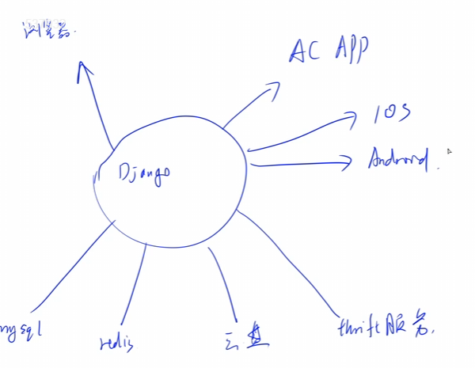
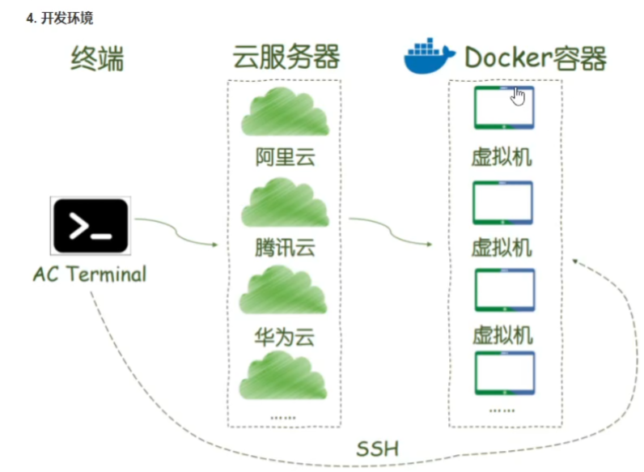
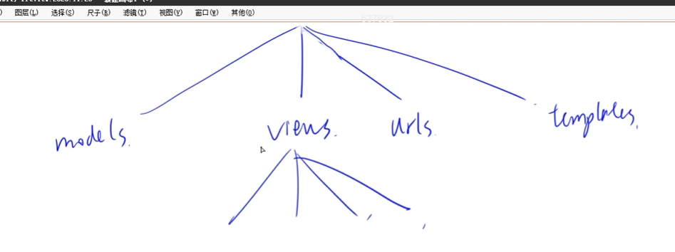

## 课程概论和Python3语法

**课程概论**

服务一般是部署在Linux服务器上，所以要学Linux

后端是一个中枢，把数据返回到前端

Why Python?

+ 计算密集型的模块可以用C/C++实现，然后编译成动态链接库再`import`进来
+ 计算密集型的微服务可以通过`thrift`等工具对接，微服务的`server`端代码可以用C/C++语言实现，比如acwing的oj判题功能
+ 有很多工具可以将Python代码翻译成C/C++，比如Cython、Pypy。

前后端分离，可以一个后端去支持多个前端。

项目架构：



操作数据库都有api，比如修改`objects.delect`

数据库分两类

+ Mysql
+ Redis 在内存里存

acwing，在云服务器中使用docker开发，非常安全

便于迁移，且所有人一样

**Python3语法**

在第一行加上`#! /usr/bin/env python3`，这样以后就可以添加可执行权限，直接使用`./main.py`来运行，指明使用python3解释器

`#-*- coding:utf-8 -*-`可以指明编码

`python3 main.py`也可以，需要指明python3，不然是python2

注释 #

算数运算

17 // 3 = 5 整除

2 ** 3 乘方 8

定义变量

width = 20

height = 5 * 9

字符串，“” 或 ‘’都代表字符串

`len()`可以求任意东西的长度

list列表 类似数组

`a = [1, 4, 9, 16, 25] b = [1, 2.0, 'yxc']`

set 集合

字典：键值对的列表

dict 类似map

while a < 10:

用==缩进==来判断循环体


循环和判断要加`:`

`x = int(input("Please enter an interger: "))`，int是一个函数，读入的是一个字符串，需要转换为整数

```python
if x < 0:
    x = 0
    print("Negative changed to zero")
elif x == 0:
    print("Zero")
else:
    print("More")
```

数据的读取`a = int(input())`如果不需要添加提示信息括号内就不写东西


**for语句**

```python
words = ['cat', 'window', 'wind'] # 列表
for v in words:
    print(v, lenth(v))
```

```python
users = {'Hans': 'active', 'yxc': 'inactive'} # 集合
for idx in users:
    print(idx, users[idx])
    
for key, value in users.items():
    print(key, value)
```

```python
for i in range(2, 10):
    flag = False
    for j in range(2, i)
    	if i % j == 0:
            flag = True
    if not flag:
        print(i)
```

**函数**

```c++
def f(a, b):
    print(a + b)
 
f(1, 2)
```

不写返回值时，默认返回Null

函数传递列表（数组）函数内修改会影响函数外的值，但是如果传的是变量，函数内修改就不会影响到函数外的值（和cpp一样）

写函数时不注明变量类型，python会自动判断，可以定义默认参数

函数传参可以传列表

```python
def f(a, b):
    print(a + b)

a = [1, 2]
f(*a)

# 解包一个字典
a = {'b': 3, 'a': 2}
f(**a)

g = lambda x, y : x + y
g(3, 4)
```

**数据结构**

列表：

```python
a = [1, 2, 3]
# 常用函数
a.append('x')
len(a)
```

列表中的每个值是可以修改的

元组：

与列表的区别是不可修改

`a = (1, 2, 3)`

集合：

```python
a = set()
a.add(1)
a.add(2)
a = {}
# 自动去重，排序
```

集合一般用于对列表判重`set(a)` `a = list(set(a))`

字典：

`a = {'jack': 4090, 'sape': 5090}`

**import**

```python
from python_lesson.model_1 import model_a
from python_lesson.model_1.model_a import fib, fib2
```

**输入与输出**

格式化字符串，选择类似printf的方式

`s = "%04d %.2lf %s" % (2, 3.4, "abc")`

加上一个%号

**异常处理**

```python
def divide(x, y):
    try:
        res = x / y
    except Exception as e: # 发生异常时执行
        print(str(e))
    else:
    	print("result is", res) # 不发生异常时执行
```

异常捕获掉了，程序不会中断，不捕获的话程序会直接中断

**类**

```python
class Car:
    def __init__(self):  # 所有成员函数都要加上self
        print("created!!")
        self.a = []
     
    def update(self):
        for i in range(len(self.a)):
            self.a[i] *= 2
            
            
```


## 配置docker、git环境与项目创建



在服务器上又套了一层docker虚拟机，最后在虚拟机中开发

`docker run -p 20000:22 -p 8000:8000 --name django_server -itd django_lesson:1.0`

相当于把这个容器的22端口映射到宿主机的20000端口，访问宿主机的20000端口就相当于访问这个22端口

部署了一台Django Web应用服务器容器

`python3 manage.py runserver 0.0.0.0:8000`



如果一个文件过于臃肿就转换为文件夹

models存储结构

views函数

urls路由，客户端向服务器端传url， 然后服务器端看这个地址对应的是哪个函数

templates存html


